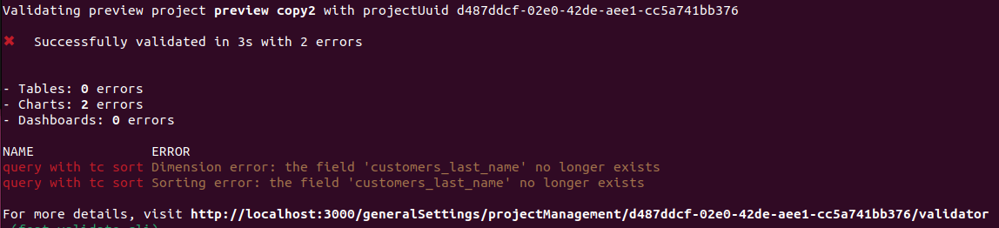

import AutomaticallyDeployChangesGithub from './../../snippets/github-secrets.mdx';
import ProjectId from './assets/project-id.png';

# Clairdash Validate

You can check to see if your changes break any of the content in your project using `clairdash validate`. This command will run the validator which will return a list of content in your project that is broken and details about the errors.

You can trigger a validation on a project using the Clairdash CLI so you can check locally if your changes will break anything. You can also add `clairdash validate` to your [GitHub Actions](#configure-github-actions) so changes can't be merged unless they pass the validation.

## Usage



### Validate your changes against your project by running clairdash validate

You can run `clairdash validate` to check if your changes break any of the content in production.
By default, `clairdash validate` will check your changes against the content in the project you've selected on the CLI.
You can change your project using `clairdash config set-project`.

```bash
clairdash validate
```

Optionally you can use the `--preview` argument to validate your last preview environment created from the CLI.

You will get a list of errors if your local files are going to break some content on your project.
These errors will not be reflected on the validation table on Clairdash settings.

### Validate any project using the project UUID

You can run a validation on any project by specifying the project UUID in the `clairdash validate` command.

```bash
clairdash validate --project <project uuid>
```

**Note:** you can get your project UUID from the Clairdash URL by selecting the ID after the `projects/`


### Validate only specific elements of your project

You can select which parts of your project you would like to validate using the `--only` argument.

```bash
clairdash validate --only tables charts dashboards
```

Available options:

- `tables`
- `charts`
- `dashboards`

## Configure Github actions

This command will create a preview environment, and then validate this preview by specifying `--preview` on the validate command.
`clairdash validate` will return an error (return code 1) if there is at least 1 validation error on your project.
You can use this output to block a deploy on Github actions like this

```bash
- name: Start preview
  run: clairdash start-preview
- name: Validate preview
  run: clairdash validate --preview
```

To learn more about setting up GitHub actions for Clairdash, check out the docs [here](/snippets/automatically-deploy-your-changes-using-github-action)
