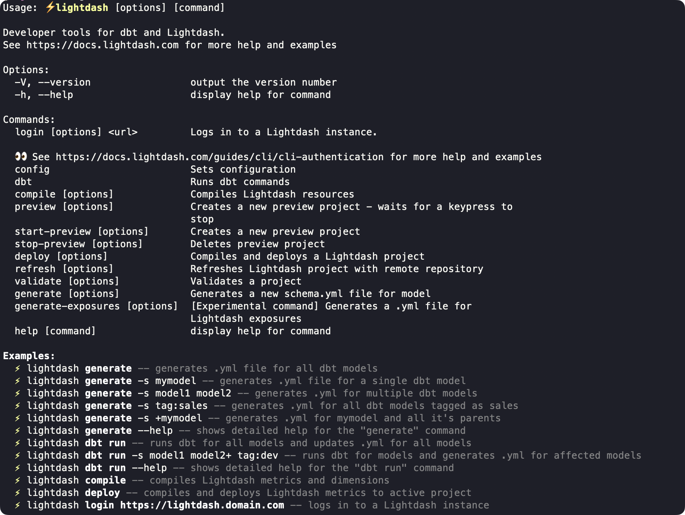

# Clairdash CLI reference

The Clairdash CLI is the recommended way to develop your Clairdash project. It makes development faster and easier, as well as giving you options for building more powerful automation to manage your Clairdash projects.

---

## Global options

There are three global options that can be used with any Clairdash CLI command: [version](#version), [help](#help), and [verbose](#verbose).

### Version

`--version` or `-V`

Ignores the preceding command and shows the installed CLI version. Usually it's used right after `clairdash`, like this:

```bash
clairdash --version
```

### Help

`--help` or `-h`

Tells you what the preceding command does and lists all command-specific options. You can view the Clairdash CLI help like this:

```console
clairdash --help
```

That returns the Clairdash CLI help menu:



When you use the `--help` or `-h` option with a speific command:

```console
clairdash validate -h
```

That returns details and examples for the command itself:


### Verbose

`--verbose`

Defaults to OFF. When included, each step will print logs as it progresses through the command. For example, here's a `--verbose` version of `clairdash generate-exposures`:


## Commands

The table below includes a complete list of all commands available in the Clairdash CLI.

For examples and command-specific options, click through the command in the table for docs, or install the Clairdash CLI and use the [global help option](#help).

| <div style={{width:'250px'}}>Command</div>            | Description                                                                     |
| ----------------------------------------------------- | ------------------------------------------------------------------------------- |
| [`login`](#clairdash-login)                           | Log in to a Clairdash instance using email/password or a token                  |
| [`config set-project`](#clairdash-config-set-project) | Choose or set the Clairdash project you are working on                          |
| [`compile`](#clairdash-compile)                       | Compile clairdash resources using your local project files                      |
| [`preview`](#clairdash-preview)                       | Create a temporary preview project, then wait for a keypress to stop            |
| [`start-preview`](#clairdash-start-preview)           | Create a preview project that stays open until it is stopped                    |
| [`stop-preview`](#clairdash-stop-preview)             | Shut down an open preview project                                               |
| [`deploy`](#clairdash-deploy)                         | Compile and deploy a Clairdash project using your local project and credentials |
| [`refresh`](#clairdash-refresh)                       | Refresh Clairdash project with remote repository                                |
| [`validate`](#clairdash-validate)                     | Validates content from your active project against your local project files     |
| [`generate`](#clairdash-generate)                     | Generates or updates schema.yml file(s) for the selected model(s)               |
| [`generate-exposures`](#clairdash-generate-exposures) | [Experimental command] Generates a .yml file for Clairdash exposures            |
| [`dbt run`](#clairdash-dbt-run)                       | Executes dbt run, then `clairdash generate` to add/update `schema.yml` files    |

---

### `clairdash login`

Log in to a Clairdash instance using email and password or a token.

```console
clairdash login [URL]
```

**Argument:**

- `[URL]`
  - The URL for your Clairdash instance (see examples below)

**Options:**

- `--token`
  - For logging in with an access token (common for SSO users)
  - Exclude this to log in with email and password

**Examples:**

Log in to Clairdash Cloud US instance (for most Starter customers):

```bash
clairdash login https://app.clairdash.cloud
```

Log in to Clairdash Cloud EU instance while showing detailed logs of login process:

```bash
clairdash login https://eu1.clairdash.cloud --verbose
```

Log in to a custom domain with a personal access token (exclude `--token` to log in with email and password):

```bash
clairdash login https://custom.clairdash.domain --token bv6105f53cb127087189cfib180a3131
```

### `clairdash config set-project`

Choose the project you're developing in so the CLI knows which project content to look at for other commands like `clairdash validate` and `clairdash preview`. If your organization only has one project you won't need to use this!

```bash
clairdash config set-project
```

This command will bring up an interactive list of projects in your organization to choose from.

If you need to set the project non-interactively, you can use one of the two optional arguments below.

**Options:**

- `--name`
  - Set the project non-interactively by passing an explicit project name
- `--uuid`
  - Set the project non-interactively by passing an explicit project UUID

**Examples:**

Set project to "Healthcare Demo":

```bash
clairdash config set-project --name "Healthcare Demo"
```

Set project to the one with this UUID:

```bash
clairdash config set-project --uuid "d75379bc-f6e9-4e52-86b2-d897cabacd0c"
```

### `clairdash compile`

Compile Clairdash resources using your local project and database credentials. dbt gets compiled first, then your Clairdash explores. If you use [dbt node selection](#dbt-node-selection) to only compile a subset of models, Clairdash will also compile models joined to those models to ensure no field references are broken.

All standard [dbt options](#dbt-options) work with `clairdash compile`.

**Examples:**

Compile the whole project:

```bash
clairdash compile
```

Compile only the `accounts` dbt model, then your Clairdash explores:

```bash
clairdash compile -s accounts
```

Compile your project using the `production` profile from your local `profiles.yml` file:

```bash
clairdash compile --profile production
```

### `clairdash preview`

Spin up a temporary preview project using your local project files and content (charts and dashboards) copied from your [selected project](#clairdash-config-set-project).

All standard [dbt options](#dbt-options) work with `clairdash preview`.

**Options:**

- `--name [preview name]`
  - Custom name for the preview project. If a name is not provided, a unique, randomly generated name will be created.
- `--start-of-week [number]`
  - Specifies the first day of the week (used by week-related date functions).
  - 0 (Monday) to 6 (Sunday)
- `--skip-dbt-compile`
  - (default: false)
  - Skip `dbt compile` and deploy from the existing ./target/manifest.json
- `--skip-warehouse-catalog`
  - (default: false)
  - Skip fetch warehouse catalog and use types defined in the YAML.
- `--use-dbt-list [true/false]`
  - (default: true)
  - Use `dbt list` instead of `dbt compile` to generate dbt manifest.json
- `--ignore-errors`
  - (default: false)
  - Allows deploy with errors on compile

**Example:**

Create a preview project with the name **PR: Add Revenue Metric** and ignore validation errors while spinning it up:

```bash
clairdash preview --name "PR: Add Revenue Metric" --ignore errors
```

### `clairdash start-preview`

Create a persistent preview project using your local project files and content (charts and dashboards) copied from your [selected project](#clairdash-config-set-project).

All standard [dbt options](#dbt-options) work with `clairdash start-preview`.

**Required argument:**

- `--name [preview name]`
  - Name for the preview project. If a preview project with this name already exists, it will be updated, otherwise it will create a new preview project.

**Options:**

- `--start-of-week [number]`
  - Specifies the first day of the week (used by week-related date functions).
  - 0 (Monday) to 6 (Sunday)
- `--skip-dbt-compile`
  - (default: false)
  - Skip `dbt compile` and deploy from the existing ./target/manifest.json
- `--skip-warehouse-catalog`
  - (default: false)
  - Skip fetch warehouse catalog and use the types defined in YAML
- `--use-dbt-list [true/false]`
  - (default: true)
  - Use `dbt list` instead of `dbt compile` to generate dbt manifest.json
- `--ignore-errors`
  - (default: false)
  - Allows deploy with errors on compile

### `clairdash stop-preview`

Shuts down a project that was created with [`clairdash start-preview`](#clairdash-start-preview).

This command does not support using dbt options.

**Required argument:**

- `--name [preview name]`
  - Name of the preview project to be deleted.

**Example:**

Shut down the preview project named **neon unicorn**.

```bash
clairdash stop-preview "neon unicorn"
```

### `clairdash deploy`

Compiles and deploys the current project to your [selected Clairdash Cloud project](#clairdash-config-set-project).

:::warning

This command is usually [used in Github Actions](/guides/cli/how-to-use-clairdash-deploy#automatically-deploy-your-changes-to-clairdash-using-a-github-action) or other deploy scripts. It is not common practice to use `clairdash deploy` to push your local changes up to Clairdash Cloud outside of your initial project creation.

:::

All standard [dbt options](#dbt-options) work with `clairdash deploy`.

**Options:**

- `--create [project_name]`
  - Create a new project. If a project name is not provided, you'll be prompted for one on creation.
- `--ignore-errors`
  - (default: false)
  - Allows deploy with errors on compile.
- `--start-of-week [number]`
  - Specifies the first day of the week (used by week-related date functions).
  - 0 (Monday) to 6 (Sunday)
- `--skip-dbt-compile`
  - (default: false)
  - Skip `dbt compile` and deploy from the existing ./target/manifest.json.
- `--skip-warehouse-catalog`
  - (default: false)
  - Skip fetch warehouse catalog and use types defined in the YAML.
- `--use-dbt-list [true|false]`
  - (default: true)
  - Use `dbt list` instead of `dbt compile` to generate dbt manifest.json.

### `clairdash refresh`

Refreshes your hosted Clairdash project using the latest code from your linked Github repository. This is equivalent to pressing **Refresh dbt** in the UI as an admin.

This command does not support using dbt options.

### `clairdash validate`

Validates a project by comparing the content in your currently selected project against your local project files. Returns all charts and dashboards that have errors.

All standard [dbt options](#dbt-options) work with `clairdash validate`.

**Options:**

- `--project [project uuid]`
  - Project UUID to validate, if not provided, the last preview will be used
- `--preview`
  - (default: false)
  - Validate the last preview if available.
- `--skip-dbt-compile`
  - (default: false)
  - Skip `dbt compile` and deploy from the existing ./target/manifest.json.
- `--skip-warehouse-catalog`
  - (default: false)
  - Skip fetch warehouse catalog and use types defined in the YAML.
- `--use-dbt-list [true/false]`
  - (default: true)
  - Use `dbt list` instead of `dbt compile` to generate dbt manifest.json.
- `--only [elems...]`
  - (default: ["charts","dashboards","tables"])
  - Specify project elements to validate.

**Example:**

Validate only dashboards and use the existing compiled dbt manifest:

```bash
clairdash validate --only ["dashboards"] --skip-dbt-compile
```

### `clairdash generate`

Generates a new `schema.yml` file or updates existing `schema.yml` for selected model(s).

All standard [dbt options](#dbt-options) work with `clairdash generate`.

**Options:**

- `-y` or `--assume-yes`
  - (default: false)
  - assume yes to prompts
- `--exclude-meta`
  - (default: false)
  - exclude Clairdash metadata from the generated .yml

**Example:**

Generate or update YAML file for a single dbt model to cover all columns in the database:

```bash
clairdash generate -s mymodel
```

### `clairdash generate-exposures`

Generates a `schema.yml` file for Clairdash exposures.

:::warning

This command is still in beta and may be removed or updated without warning.

:::

This command does not support using dbt options.

**Options:**

- `--project-dir [path]`
  - (default: ".")
  - The directory of the dbt project
- `--output [path]`
  - The path where the output exposures YAML file will be written

**Example:**

Create or update YAML file called `clairdash-exposures.yml` in the current directory with all exposures in Clairdash:

```bash
clairdash generate-exposures --output ./clairdash-exposures.yml
```

### `clairdash dbt run`

Runs dbt and then generates or updates `schema.yml` file(s) for models that have columns missing or changed from the existing `schema.yml` files.

Any dbt option that works with `dbt run` will also work with `clairdash dbt run`. That includes all the [Clairdash dbt options](#dbt-options), and more ([see dbt run docs](https://docs.getdbt.com/reference/commands/run)).

**Options:**

- `--exclude-meta`
  - (default: false)
  - exclude Clairdash metadata from the generated .yml
- `-y` or `--assume-yes`
  - assume yes to prompts (default: false)

**Examples:**

Run a single model and create or update its `schema.yml` file:

```bash
clairdash dbt run --select mymodel
```

## dbt options

These are options from the dbt Core CLI that also work with some Clairdash CLI commands.

### dbt node selection

You can select a subset of your dbt models by using the following options on any Clairdash commands that support dbt options.

**Node selection:**

- `-s [models...]` or `--select [models...]`
  - [Read the dbt docs on select](https://docs.getdbt.com/reference/node-selection/syntax#shorthand)
- `-m [models...]` or `--models [models...]`
  - This is a legacy term for `--select`
- `--exclude [models...]`
  - [Read the dbt docs on exclude](https://docs.getdbt.com/reference/node-selection/exclude)
- `--selector [selector_name]`
  - [Read the dbt docs on selector](https://docs.getdbt.com/reference/node-selection/yaml-selectors)

### dbt flags

These dbt flags work with Clairdash commands that support dbt options. [Read the dbt docs on global config flags](https://docs.getdbt.com/reference/global-configs/about-global-configs#available-flags) for details.

- `--project-dir [path]`
- `--profiles-dir [path]`
- `--profile [name]`
- `--target [name]`
- `--no-version-check`
- `--state [state]`
- `--full-refresh`

### dbt project variables

You can set dbt project variables in Clairdash commands that support dbt options. [Read the dbt docs on project variables](https://docs.getdbt.com/docs/build/project-variables) for details.

`--vars [vars]`

### dbt threads

You can set the number of threads for dbt in Clairdash commands that support dbt options. [Read the dbt docs on threads](https://docs.getdbt.com/docs/running-a-dbt-project/using-threads) for details.

`--threads [number]`
